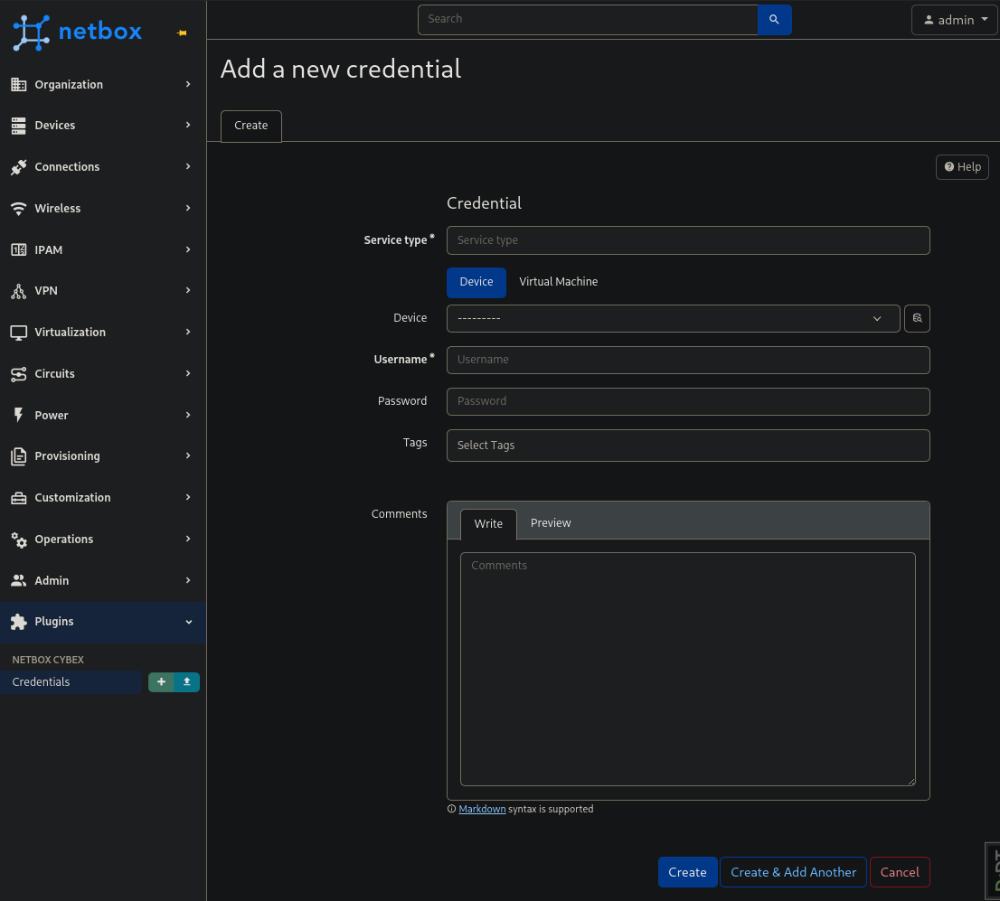

# Netbox Plugin: CybEx

This plugin adds features for cyber exercieses to your [NetBox](https://github.com/netbox-community/netbox) instance.
It should be used exclusively for it-security trainings and cyber exercises 
where applications such as Netbox are out of scope. Do **not** use parts of 
this plugin (e.g. credentials section) in a non training environment!

## Preview





## Development Environment
```sh
git clone --branch v3.7.2 --single-branch https://github.com/netbox-community/netbox ~/netbox
python3 -m venv ~/netbox/venv
source ~/netbox/venv/bin/activate
pip3 install -r ~/netbox/requirements.txt

# create configuration from example
cat ~/netbox/netbox/netbox/configuration_example.py | \
  sed -e "s/^DEBUG.*/DEBUG = True/" | \
  sed -e "s/^SECRET_KEY.*/SECRET_KEY = '$(~/netbox/netbox/generate_secret_key.py)'/" | \
  sed -e "s/^ALLOWED_HOSTS.*/ALLOWED_HOSTS = \[\'127.0.0.1\'\]/" | \
  sed -e "s/'USER': ''/'USER': 'postgres'/" > ~/netbox/netbox/netbox/configuration.py

# start database and redis
docker compose up -d

~/netbox/netbox/manage.py migrate
~/netbox/netbox/manage.py createsuperuser \
  --username admin \
  --email admin@localhost.localdomain
~/netbox/netbox/manage.py runserver

# netbox should now reachable on: http://127.0.0.1:8000/

# build plugin
python3 setup.py develop

# add plugin to configuration
sed -i -e "s/^PLUGINS.*/PLUGINS = \['netbox_cybex'\]/" ~/netbox/netbox/netbox/configuration.py

# enable developer mode to enable usage of makemigrations
echo "DEVELOPER=True" >> ~/netbox/netbox/netbox/configuration.py

# Building the app
~/netbox/netbox/manage.py makemigrations
~/netbox/netbox/manage.py migrate
```

## TODO
- The inline credentials card needs to be added to [`virtualmachine.html`:84](https://github.com/netbox-community/netbox/blob/v3.7.2/netbox/templates/virtualization/virtualmachine.html) and [`device.html`:159](https://github.com/netbox-community/netbox/blob/v3.7.2/netbox/templates/dcim/device.html). I don't know yet how to override these templates (which are part of netbox), until we figured it out, it's easiest to overwrite them, or mount our own template onto this file (when netbox is running as a docker container).
  ```html
  <!-- templates/virtualization/virtualmachine.html -->
  <div class="row">
    <div class="col col-md-12">
      <div class="card">
        <h5 class="card-header"></h5>
        <div class="card-body htmx-container table-responsive"
          hx-get="?virtual_machine_id={{ object.pk }}"
          hx-trigger="load"></div>
        <div class="card-footer text-end noprint">
          <a href="?device={{ object.device.pk }}&virtual_machine={{ object.pk }}&return_url={{ object.get_absolute_url }}" class="btn btn-sm btn-primary">
            <span class="mdi mdi-plus-thick" aria-hidden="true"></span> 
          </a>
        </div>
      </div>
    </div>
  </div><br/>
  ```
  ```html
  <!-- templates/dcim/device.html -->
  <div class="row">
    <div class="col col-md-12">
      <div class="card">
        <h5 class="card-header"></h5>
        <div class="card-body htmx-container table-responsive"
          hx-get="?device={{ object.pk }}"
          hx-trigger="load"></div>
        <div class="card-footer text-end noprint">
          <a href="?device={{ object.pk }}&return_url={{ object.get_absolute_url }}" class="btn btn-sm btn-primary">
            <span class="mdi mdi-plus-thick" aria-hidden="true"></span> 
          </a>
        </div>
      </div>
    </div>
  </div><br/>
  ```
- Think about other useful extensions
  - Firewall
    - generate rules for iptables/vyatta/firewalld (maybe even commands to add them to pfsense if somehow possible)
    - need to be easily manageable using importable data, otherwise gui needs to be used, which sucks... (same with pfSense)
- Test API (Make sure it's working as expected)
- Create ansible module `cybex.netbox.netbox_credential` to add creds to existing virtual machine
